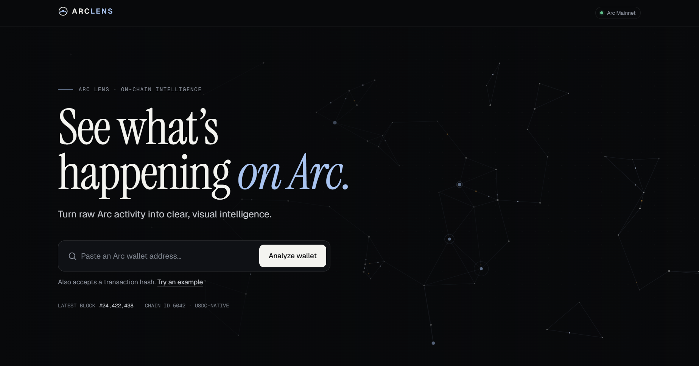
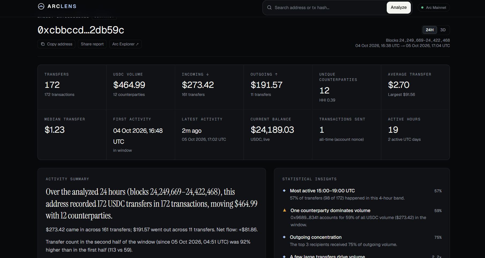
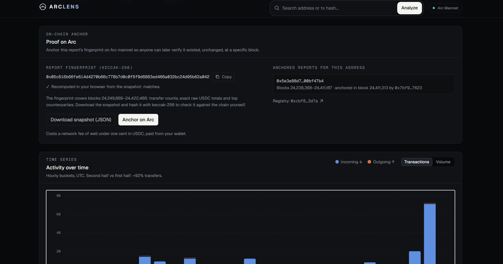

# ArcLens

**See what's happening on Arc and Robinhood Chain.**

ArcLens turns supported EVM chain activity into a visual, plain-English intelligence report. Select a network, then paste a wallet
address or transaction hash. ArcLens reads the chain, does the arithmetic, and shows you what happened in that chain's asset units.

> Built for [Arc Microgrants](https://dorahacks.io/hackathon/arc-microgrants/detail). Informational analytics only, not financial advice.

---

## Problem
Every transfer on Arc is public, but it arrives as hex: topics, raw integers, block numbers. Explorers show individual records. To answer
*"what has this address been doing?"* you still have to read hundreds of entries and do the math yourself.

## Solution
ArcLens retrieves Arc mainnet native USDC activity and Robinhood Chain Testnet native ETH/ERC-20 activity, normalizes the selected
asset, computes reusable statistics, and presents:

- **Headline stats**: transfers, transactions, selected-asset volume (in / out / net), unique counterparties, average and median transfer,
  largest transfer, first and latest activity, live balance, and all-time transactions sent.
- **Activity over time**: stacked in/out bars by hour, toggled between count and volume, with exact values on hover or keyboard focus.
- **Activity heatmap**: UTC weekday × hour.
- **Value flow**: top senders → wallet → top recipients, sized by volume.
- **Counterparties**: a ranked, sortable, filterable table. Every address links to its own report.
- **Transaction explorer**: search, filter (incoming / outgoing / large / recent), sort, paginate, and expand for full details.
- **Summary and insights**: sentences generated only from computed numbers (peak hours, concentration, skew, period-over-period change).
  No attribution, no speculation.
- **Transaction page**: status, native value and token transfer logs, network-native gas fee, sender nonce, and confirmations.
- **Proof on Arc**: every report has a keccak-256 fingerprint of its data. Anyone can **anchor** it on Arc mainnet through the
  `ArcLensRegistry` contract from their own wallet, and download the snapshot JSON to verify it later.

## On-chain component: ArcLensRegistry
ArcLens reads from Arc and writes proofs back to it.

- Contract: [`contracts/ArcLensRegistry.sol`](contracts/ArcLensRegistry.sol). No owner, no fees, holds no funds. It stores
  `(reportHash, subject, anchoredBy, fromBlock, toBlock, anchoredAt)` and emits `ReportAnchored`.
- Fingerprint: `keccak256` of a canonical JSON snapshot (exact raw selected-asset totals, counts, chain ID, asset, block range, top counterparties),
  built in [`src/lib/analytics/snapshot.ts`](src/lib/analytics/snapshot.ts). The browser recomputes the hash to prove it matches.
- Tested: the compiled bytecode runs against a real in-process EVM in
  [`src/lib/__tests__/registry.test.ts`](src/lib/__tests__/registry.test.ts) (anchoring, duplicates, invalid ranges, per-address listing).
- Address fixed in advance: deployed with CREATE2 through the canonical factory `0x4e59b448…956c` (present on Arc mainnet),
  salt `keccak256("arclens.registry.v1")`, so the registry lives at **`0xcbf8dc0b71802694aafd6adb2149043a165b3d7a`**.
  ArcLens checks for code there at runtime and switches anchoring on automatically. A test proves the address on an in-process EVM,
  and a simulated deployment against Arc mainnet returned the same address.
- Deployment: the registry is deployed on Arc mainnet at **`0xcbf8dc0b71802694aafd6adb2149043a165b3d7a`** ([view on Arc Explorer](https://explorer.arc.io/address/0xcbf8dc0b71802694aafd6adb2149043a165b3d7a)). ArcLens checks for code at this address and enables report anchoring automatically.
- Rebuild the ABI and bytecode after editing the contract: `npm run compile:contract`.

## Network data paths

- **Arc Mainnet:** native USDC activity comes from Arc's EIP-7708 `Transfer` logs. The mirrored ERC-20 log is skipped to avoid
  double counting. Existing Arc analytics and ArcLensRegistry anchoring remain available.
- **Robinhood Chain Testnet:** native ETH movements come from the explorer's indexed external transactions and successful internal
  traces. ERC-20 activity comes from indexed standard `Transfer(address,address,uint256)` logs, with token symbol and decimals from
  explorer metadata. The app does not assume Arc's EIP-7708 event exists on Robinhood Chain.
- Select one asset at a time. The report shows token units and does not combine different assets or infer USD values.
- Report fingerprints include the selected chain and asset. The `ArcLensRegistry` remains deployed on Arc and can anchor a report
  snapshot for either supported source network.

Research and endpoint details: [`docs/robinhood-research.md`](docs/robinhood-research.md).

## Why Arc
- USDC is Arc's native gas token, so activity is dollar-denominated with no price feed.
- Arc emits **EIP-7708** `Transfer` logs for every native USDC movement. ArcLens reads that stream and ignores the mirrored 6-decimal
  ERC-20 log to avoid double counting.
- Deterministic finality means closed block ranges never change, so ArcLens caches them indefinitely.

Details and sources: [`docs/arc-research.md`](docs/arc-research.md).

## Architecture
```
Browser (Next.js client components)
   │  fetch (same-origin only)
   ▼
API routes  /api/wallet/[address] (NDJSON stream) · /api/tx/[hash] · /api/status
   │  validation · per-IP rate limit · concurrency cap · safe error envelopes
   ▼
Report builder        src/lib/arc/report.ts     (shared analytics; network dispatch)
   ├── Arc provider    src/lib/arc/provider.ts  (EIP-7708 logs + Arc RPC)
   └── Robinhood       src/lib/robinhood/       (testnet JSON-RPC + explorer indexer)
       ├── native ETH transactions and internal traces
       └── ERC-20 standard Transfer logs
   ▼
JSON-RPC clients      src/lib/arc/rpc.ts        (throttle, failover, backoff)

Pure analytics (unit-tested, no I/O):
  src/lib/analytics/normalize.ts   normalizeTransaction · toWalletTransactions
  src/lib/analytics/stats.ts       calculateWalletStats · calculateVolumeStats · calculateCounterpartyStats
                                   calculateTimeSeries · calculateActivityHeatmap · comparePeriods
  src/lib/analytics/summary.ts     generateWalletSummary
  src/lib/analytics/transaction.ts buildTransactionInsight · decodeMovements
```

## Tech stack
- **Next.js 16** (App Router, route handlers, streaming) and **TypeScript**
- **Tailwind CSS v4** with custom design tokens
- **motion** for purposeful animation (respects `prefers-reduced-motion`)
- **d3-scale / d3-shape** plus hand-built SVG charts (no heavy chart library)
- **Vitest** for unit tests
- **viem** for ABI encoding and the optional browser-wallet flow; **solc** + **@ethereumjs/evm** to compile and test the contract
- No database, no accounts; a wallet is only needed to anchor

## Data sources
| Source | Used for |
| --- | --- |
| `https://rpc.mainnet.arc.io` (official Arc RPC) | Logs, balances, nonces, bytecode, transactions, receipts |
| `https://rpc.testnet.chain.robinhood.com` (official Robinhood Chain Testnet RPC) | ETH balance, nonce, bytecode, blocks, transactions, receipts |
| `https://explorer.testnet.chain.robinhood.com/api/v2` | Indexed ETH transaction history, internal traces, and ERC-20 transfer logs |
| [docs.arc.io contract addresses](https://docs.arc.io/arc/references/contract-addresses) | The only source of named labels |

**Limitations:** Arc's public RPC caps `eth_getLogs` at 10,000 blocks (~83 minutes) and is rate-limited, so the default deployment
analyzes **24h and 3d windows**. Robinhood testnet reports are capped at the explorer indexer's latest indexed block and use a
configurable default maximum window of **3d**. Explorer indexing and RPC data may lag. Every report states its exact block range.

## Local setup
```bash
npm install
cp .env.example .env.local   # optional: every variable has a safe default
npm run dev                  # http://localhost:3000
```

Other scripts:
```bash
npm test          # unit tests (analytics, validation, snapshot, contract on an in-process EVM)
npm run lint
npm run typecheck
npm run build
```

## Environment variables
See [`.env.example`](.env.example).

| Variable | Scope | Default | Purpose |
| --- | --- | --- | --- |
| `NEXT_PUBLIC_SITE_URL` | public | `http://localhost:3000` | Canonical URL for metadata and sitemap |
| `NEXT_PUBLIC_GITHUB_URL`, `NEXT_PUBLIC_X_URL` | public | placeholders | Footer links |
| `NEXT_PUBLIC_CONTACT_EMAIL` | public | empty | Contact on legal pages |
| `NEXT_PUBLIC_PLAUSIBLE_DOMAIN` | public | empty (off) | Optional cookieless analytics |
| `NEXT_PUBLIC_REGISTRY_ADDRESS` | public | CREATE2 address | Override the ArcLensRegistry address |
| `ARC_RPC_URLS` | **server** | Arc public RPC | Comma-separated RPC URLs (may contain keys) |
| `ARC_LOG_BLOCK_RANGE` | server | `10000` | Block span per `eth_getLogs` |
| `ARC_RPC_CONCURRENCY` / `ARC_RPC_MIN_INTERVAL_MS` | server | `3` / `380` | Pacing per endpoint (public RPC sustains ~2.5 req/s) |
| `ARC_MAX_WINDOW` | server | `3d` | Largest analysis window offered |
| `ROBINHOOD_RPC_URLS` | **server** | Official testnet RPC | Comma-separated Robinhood Chain Testnet RPC URLs (may contain keys) |
| `ROBINHOOD_EXPLORER_API_URL` | **server** | Official testnet explorer API | Blockscout-compatible API base used for indexed address history |
| `ROBINHOOD_MAX_WINDOW` | server | `3d` | Largest Robinhood testnet analysis window offered |
| `ROBINHOOD_MAX_EXPLORER_PAGES` | server | `200` | Bound on indexed pages fetched per activity category |
| `ROBINHOOD_RPC_CONCURRENCY` / `ROBINHOOD_RPC_MIN_INTERVAL_MS` | server | `2` / `250` | Robinhood RPC pacing |
| `ARC_RATE_LIMIT_PER_MINUTE` | server | `12` | Analyses per IP per minute |

## Security notes
- No secrets in the frontend. RPC URLs are server-only, and the browser only talks to ArcLens's own origin (enforced by CSP
  `connect-src 'self'`).
- All inputs are validated before any network call (strict address and hash regexes, length caps, window allow-list).
- Upstream error text is never forwarded to clients. Responses use fixed, user-safe messages.
- Per-IP rate limiting and a per-instance concurrency cap on the expensive analysis endpoint. Scans stop when the client disconnects.
- Headers: CSP, `X-Frame-Options: DENY`, `nosniff`, strict `Referrer-Policy`, `Permissions-Policy`, HSTS.
- React escapes all rendered text, and there is no `dangerouslySetInnerHTML`.
- The rate limiter is in-memory (per instance). For multi-instance production, use a shared store.

## Privacy
No accounts, cookies, or database. Analytics are off by default, and if enabled they are cookieless and never include addresses or hashes.
See [`/privacy`](src/app/privacy/page.tsx).

## Deployment
Designed for Vercel (or any Node host):
1. Push to GitHub and import the repo in Vercel.
2. Set `NEXT_PUBLIC_SITE_URL` (and optionally the other public vars) in project settings.
3. Deploy. HTTPS is automatic.

`/api/wallet/*` streams for up to 120 s (`maxDuration`). Make sure your plan allows it.

## Screenshots

### Landing page



### Wallet intelligence report



### Proof anchored on Arc



## Demo
**Live:** https://arclens-three.vercel.app

## Hackathon
Built for **Arc Microgrants** on DoraHacks.

## Future possibilities
- Additional supported networks and indexer options
- Verify page: paste a snapshot JSON and check it against the registry
- CSV / PNG export (JSON snapshot export exists)

## License
Not yet chosen for the app code (the contract is MIT-licensed via its SPDX header). Fonts under `src/assets/fonts` are licensed under the SIL Open
Font License (see the license files there).
